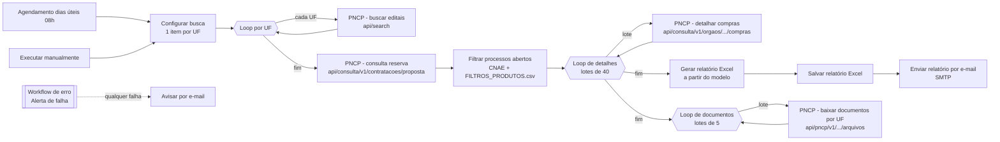

# Captação de licitações 2026 — PNCP (n8n)

Automação em n8n que busca pregões eletrônicos com proposta aberta no **PNCP**, filtra pelo CNAE e pela lista de produtos da empresa, gera um relatório Excel a partir de um modelo, envia o relatório por e-mail e baixa editais e anexos organizados por UF.

- **UFs:** SP, MG, GO, PR, SC e MS
- **Modalidade:** 6 (pregão eletrônico), janela dos próximos 21 dias
- **Agenda:** dias úteis às 08h (`0 0 8 * * 1-5`), além de execução manual
- **Empresa de referência:** Camargo Science Soluções Diagnósticas, CNAE 46.45-1-01 (principal) e 47.73-3-00

## Conteúdo desta pasta

| Caminho | O que é |
|---|---|
| `workflows/01-captacao-licitacoes-pncp.json` | Workflow principal (15 nós), pronto para importar |
| `workflows/02-alerta-falha-captacao.json` | Workflow de erro: avisa por e-mail quando o principal falha |
| `codigo/*.js` | Código de cada nó Code, extraído para leitura e revisão (a fonte da verdade são os JSONs) |
| `arquivos-apoio/FILTROS_PRODUTOS.csv` | Lista de produtos: `o_que_vendo, tipos_de_produto, o_que_nao_vendo` |
| `arquivos-apoio/MODELO_RELATORIO_SEMANAL_OPORTUNIDADES.xlsx` | Modelo do relatório, com as abas `Resumo semanal` e `Oportunidades` |
| `docker/docker-compose.yml` + `.env.example` | Container n8n com as variáveis que o fluxo exige |

## Fluxo



### Etapas

1. **Configurar busca**: gera um item por UF, com modalidade 6 e datas de hoje a +21 dias (fuso de Brasília).
2. **PNCP - buscar editais**: consulta `https://pncp.gov.br/api/search/` (status `recebendo_proposta`, até 500 por página). Repete após 3, 8, 15, 30 e 45 s, com limite de 240 s por UF porque o task runner encerra nós Code com mais de 300 s.
3. **PNCP - consulta reserva**: para UFs em que a busca falhou, usa a API oficial `api/consulta/v1/contratacoes/proposta` (50 por página) e converte o resultado para o formato da busca.
4. **Filtrar processos abertos**: descarta cancelados, duplicados e prazos fora da janela. Mantém objetos compatíveis com o CSV de produtos e com os termos do CNAE, e exclui serviços, obras, alimentação, TI etc. Se todas as consultas falharem, o nó lança erro para não enviar e-mail vazio.
5. **PNCP - detalhar compras**: completa número do processo, número da compra e link do sistema de origem (uma consulta a cada 2,5 s para evitar bloqueio).
6. **Gerar relatório Excel**: preenche o XML do modelo diretamente (via `@e965/xlsx` / CFB) sem perder a formatação. Faz contagem por UF, formatação condicional dos prazos e área de impressão, e valida o arquivo gerado.
7. **Salvar relatório Excel**: grava em `/files/PREGÕES_2026/Relatório de Licitações - DD.MM.AAAA.xlsx`.
8. **Enviar relatório por e-mail**: SMTP com o Excel anexo e um aviso quando alguma UF ficou incompleta.
9. **PNCP - baixar documentos por UF**: salva edital, anexos e TR em `PREGÕES_2026/<UF>/<DD.MM.AAAA - HHhMM - ÓRGÃO - PE nº>/`. Não baixa de novo arquivos que já existem, então a execução seguinte completa o que faltou.
10. **Alerta de falha** (workflow de erro): envia por e-mail o nó que falhou, a mensagem e o link da execução.

### APIs utilizadas (públicas, sem autenticação)

| Endpoint | Uso |
|---|---|
| `GET https://pncp.gov.br/api/search/` | Busca principal de editais |
| `GET https://pncp.gov.br/api/consulta/v1/contratacoes/proposta` | Consulta reserva por UF |
| `GET https://pncp.gov.br/api/consulta/v1/orgaos/{cnpj}/compras/{ano}/{seq}` | Detalhe da compra |
| `GET https://pncp.gov.br/api/pncp/v1/orgaos/{cnpj}/compras/{ano}/{seq}/arquivos` | Lista e download de documentos |

O fluxo não usa agentes de IA nem subworkflows. A única credencial é **SMTP**.

## Como instalar

1. **Subir o n8n**
   ```bash
   cd docker
   cp .env.example .env   # ajuste PASTA_ARQUIVOS
   docker compose up -d
   ```
   Se preferir outro container, o que importa são as variáveis `N8N_RESTRICT_FILE_ACCESS_TO`, `NODE_FUNCTION_ALLOW_BUILTIN`, `NODE_FUNCTION_ALLOW_EXTERNAL`, `NODE_PATH` e o volume `/files`.

2. **Arquivos de apoio**: crie `PREGÕES_2026/` dentro da pasta montada e copie para ela `FILTROS_PRODUTOS.csv` e `MODELO_RELATORIO_SEMANAL_OPORTUNIDADES.xlsx`.

3. **Importar os workflows** (o de erro primeiro, porque o principal referencia o ID `AlertaFalhaLicit01`):
   ```bash
   docker cp workflows/. n8n:/tmp/wf/
   docker exec n8n n8n import:workflow --separate --input=/tmp/wf/
   ```
   Também é possível importar pela interface: *Workflows → Import from File*.

4. **Credencial SMTP**: crie uma credencial *SMTP* (para Gmail: `smtp.gmail.com`, porta 465, SSL, senha de app) e selecione-a nos nós **Enviar relatório por e-mail** e **Avisar por e-mail**.

5. **E-mails**: nos dois nós de e-mail, troque os placeholders `remetente@exemplo.com`, `destinatario1@exemplo.com`, `destinatario2@exemplo.com` e `alertas@exemplo.com` pelos endereços reais. Os e-mails reais foram removidos porque o repositório é público.

6. **Ativar**: confirme em *Settings → Error workflow* que o principal aponta para "Alerta de falha - Captação de licitações" e ative o workflow principal.

## Personalização

- **UFs**: nós *Configurar busca*, *Filtrar processos abertos* e *Gerar relatório Excel* (lista `['SP','MG','GO','PR','SC','MS']`).
- **Janela de prazo**: `+21` dias em *Configurar busca* e `21 * 86400000` em *Filtrar processos abertos*.
- **Produtos**: edite `FILTROS_PRODUTOS.csv`. Separe variações com `/` em `o_que_vendo`, e termos com `;` em `tipos_de_produto` e `o_que_nao_vendo`.
- **Exclusões gerais**: lista `foraDoCnae` em *Filtrar processos abertos*.

## Observação

A automação serve para triagem comercial. Antes de decidir participar, confira o edital, os anexos, a habilitação, os requisitos técnicos e o prazo final no portal de origem.
